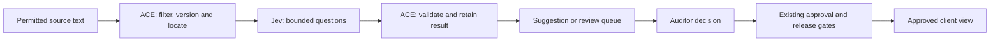

**Jev For SQE / ACE — Research As At 18 September 2026**

**Recommendation: run a small fictional-data pilot for evidence checking and submission guidance.** Jev could make frequent semantic checks affordable enough to become a normal part of the product. The strongest opportunity is to help people notice missing, conflicting or poorly supported information earlier. Auditor Decisions, MATE ratings, conclusions and client publication must retain their existing authority.

This investigation covers the ACE auditor workbench and its controlled client experience, based on local source and planning documents. It does not assume that every planned capability is deployed. No Jev API calls, purchases, installations or product changes were made. Private repository content was not sent to TypeSafe or included in web searches.

**What Has Actually Been Released**

TypeSafe announced direct early access on **15 September 2026**. It describes a new architecture, parallel sampler and Reinforcement Learning for Calibrated Decisions (RLCD); these remain vendor descriptions. Its selected-workflow claims of 193.6× faster and 444.6× cheaper are acknowledged high-end gains. [Launch announcement](https://typesafe.ai/blog/introducing-system-one-models-and-jev).

Vercel separately announced Gateway availability on **16 September**. That confirms a second access route, not independent validation of the performance claims. The integration uses `typesafe-ai/jev` and AI SDK 7's experimental `evaluate` API, supported from version 7.0.105. The research did not test account access. [Vercel announcement](https://vercel.com/changelog/typesafe-ai-jev-now-available-on-ai-gateway).

Live documentation lists **`jev-1.13.0`**, currently behind both `jev-latest` and `jev-preview`. Pin the version because aliases move. Input is text/JSON; images, audio and video require preprocessing. Limits are 64k total tokens and 32k for state plus the longest question. Published throughput limits are 250,000 tokens/second and 1,200 requests/minute, subject to change. English is the strongest documented language. These specifications were retrieved on 18 September; performance was not tested. [Models](https://docs.typesafe.ai/models).

The documented evaluation call accepts supplied `state` and named `questions`. It provides no retrieval, web browsing, report-generation or action-execution step. The application supplies source material and acts on results. [HTTP API](https://docs.typesafe.ai/api).

| Primitive | What It Returns | Example For ACE |
| --- | --- | --- |
| Noul | Probability that a yes/no proposition is true | Does this passage explicitly identify an accountable role? |
| Choice | One permitted option, option probabilities and confidence | Supports / weakens / contradicts / unrelated / insufficient context |
| Score | A probability-weighted position on or between ordered rubric levels, level probabilities and confidence | How clearly does this submitted response address the requested evidence? |

The primitives can share a request, but questions are evaluated independently against the same state. A later question cannot depend on another answer from that call. Decomposition and combination belong in code. [Introduction](https://docs.typesafe.ai/introduction), [Score](https://docs.typesafe.ai/primitives/score), [Noul](https://docs.typesafe.ai/primitives/noul).

Choice supports up to 255 options. Include an explicit “none” or “insufficient context” option where appropriate. For selecting several relevant passages, use one relevance question per candidate; a single Choice answers which *one* wins. [Choice](https://docs.typesafe.ai/primitives/choice).

**What “Reliable” Does And Does Not Mean**

The launch's zero-error figure concerns schema validity, not measured decision accuracy. An allowed label can still be wrong. [Launch explanation](https://typesafe.ai/blog/introducing-system-one-models-and-jev).

Choice and Score `confidence` summarise the shape of the returned distribution. Noul has no separate confidence field. A confidence value of 0.95 must not be displayed as “95% certain this control is effective”. Calibration must be measured for our questions, population, model version and action thresholds. [Confidence](https://docs.typesafe.ai/confidence).

The known-limitations page, reviewed **17 September**, explicitly identifies:

- Weak counting, numerical precision and date comparison.
- Errors from literal wording, negation and multiple reasoning steps.
- Lower accuracy when irrelevant material fills the context.
- Susceptibility to adversarial instructions inside input data.
- Inconsistent relationships between separately asked questions.
- No practical free-text generation.

Thus date ordering, deadlines, arithmetic and logical invariants belong in code. Treat Jev's semantic screening as an additional signal, never the sole security boundary. [Jev 1.13 limitations](https://docs.typesafe.ai/model-jaggedness/jev-1.13).

Batching can avoid repeated state and network round trips. It does not make extra questions free or allow unlimited work at constant latency. Split requests by relevant context and measured limits. [Batching pattern](https://docs.typesafe.ai/patterns/fan-out).

**How Strong Is The Evidence?**

| Evidence | What It Establishes | Main Limitation |
| --- | --- | --- |
| TypeSafe workflow evaluations | Vendor demonstrations across security incidents, agent traces, invoices and customer service | Reference labels come from frontier-model consensus, not independently adjudicated outcomes |
| September API and model documentation | Concrete interfaces, version identifiers and supported input/output forms | Documentation is not a production acceptance test |
| Aera first-person study, independent of TypeSafe | Measured benefits for a specific retrieval-selection task | One internal profile, model-generated labels and short observation period |
| Published cookbooks | Implementable patterns for extraction, checking and classification | Examples and cached historical runs, not SQE validation |

The evaluation site gives four workflows equal weight and compares them with reference answers derived from GPT-6 Astra and Claude Fable 5.1 at high reasoning. Comparators use their providers' default reasoning settings. Its “accuracy” therefore means agreement with that reference. It cannot establish accuracy against WHS obligations or auditor judgements. [Evaluation methodology](https://evals.typesafe.ai/).

Vendor-designed workflows, probability-producing comparator wrappers and US West Coast measurements qualify the launch results. The reported 70–500 ms response range is not a Sydney latency commitment. [Benchmark qualifications](https://typesafe.ai/blog/introducing-system-one-models-and-jev).

Aera published a 400-case study on **17 September**. On 276 unattended cases with the same candidate pool, Jev matched the comparison model's 46% needs coverage, improved matcher-judged precision from 79% to 85%, and reduced reported median model time from 463 to 147 ms in its US benchmark. The comparison used DeepSeek V4 Flash without reasoning. Labels came from an AI hindsight judge and matcher, rather than human ground truth. The study used one internal working profile and was not a shipped integration. More questions caused slowdowns and rate limits; some wider retrieval configurations cost more than the LLM baseline. This supports a focused pilot, not universal superiority. [Aera study](https://aerabrowser.com/news/agent-memory-doesnt-need-a-generator-typesafes-jev-vs-llm-on-400-real-tasks).

I found no independent evaluation on ACE's audit method or Australian safety evidence. Claims of calibrated probabilities and suitability for our workflows remain unverified.

**Capabilities That Make New Features Plausible**

TypeSafe publishes examples that go beyond ticket classification:

- **Citation checking:** code first checks whether a quote exists; Jev judges whether its context supports a claim. The displayed eight-case example uses cached Jev 1.12 results dated 16 August. It illustrates a design, not current-version accuracy. [Citation cookbook](https://docs.typesafe.ai/cookbooks/citation_check).
- **Finding contrary evidence:** classify retrieved passages for relevance, evidentiary content and contradiction. Preserve contradictory material for review. The example's cached Jev 1.12 run is from 27 August. [Passage classification](https://docs.typesafe.ai/cookbooks/classifying_rag_passages).
- **Source-bound extraction:** the Jev 1.12 example uses a parser to find candidate values; Jev selects among them; code copies the original value. It can choose the wrong candidate, but cannot invent a new value outside the supplied choices. [Extraction cookbook](https://docs.typesafe.ai/cookbooks/pre_parsed_value_extraction_cookbook).
- **Entity alignment:** compare candidate pairs and distinguish possible duplicates from different entities. The published example uses historical Jev 1.12 results from 11 August. In ACE, matches would be proposals, with no automatic merging. [Entity alignment](https://docs.typesafe.ai/cookbooks/entity_alignment).

**Fit With The Product We Have**

ACE's local vocabulary and implemented approval/conclusion gates separate Evidence Items, Proposed Relationships, Auditor Decisions and Approved Conclusions. MATE concerns control design; implementation and effectiveness are separate conclusions. The inspected approval code checks reviewed sources, unresolved contradictions and matching proposal versions before evaluation. [Vocabulary](LOCAL_HOME/Documents/agentic-os-workspace/sqe/CONTEXT.md), [Approval gate](LOCAL_HOME/Documents/agentic-os-workspace/sqe/src/ace/engine/approval.py), [Conclusion gate](LOCAL_HOME/Documents/agentic-os-workspace/sqe/src/ace/engine/conclusion.py).

The provider-neutral plan already places extracted candidates in proposal queues and keeps mobile access behind ACE's API. It explicitly treats remote model calls as external transfers. This is a suitable *planning boundary* for Jev. No implemented Jev adapter or approved live customer-submission route was established by the inspected sources. The client-release lifecycle specification is marked draft. [Provider boundaries](LOCAL_HOME/Documents/agentic-os-workspace/sqe/docs/specs/2026-08-23-ace-provider-neutral-extraction-and-retrieval-boundaries.md), [Release specification](LOCAL_HOME/Documents/agentic-os-workspace/sqe/docs/specs/2026-08-22-phase-6b2-controlled-client-release-lifecycle.md).

The roadmap already anticipates gaps, conflicts and assisted extraction. Jev's new contribution would be the frequency and placement of those checks: during submission, after a source changes, and before a person starts reviewing. [Roadmap](LOCAL_HOME/Documents/agentic-os-workspace/sqe/ACE_VISION_AND_ROADMAP.md).

**Customer-Facing Opportunities**

These are proposed product directions, not existing functionality or validated Jev performance. The roadmap's 7 September status limits development to fictional, public or AuditCo-owned material. Live client use needs an accepted scope and data approval; current client acceptance was not separately verified.

| Priority | Proposed Feature | Concrete Experience | Dependency And Boundary |
| --- | --- | --- | --- |
| 1 | Evidence submission assistant | A provider uploads a procedure; ACE flags that the request asked for evidence of actual implementation, and offers an approved follow-up checklist | New authorised submission surface; extracted text and request rubric. Keep the original submission and permit manual review |
| 2 | Corrective-action evidence precheck | A person requests closure; ACE identifies which required evidence categories appear addressed or missing | Approved closure checklist and source-linked candidates. Auditor retains closure decision |
| 3 | Change-impact notifications | A revised procedure appears; ACE proposes which controls, questions and previously reviewed evidence need attention | Version diff, approved relationship graph and later approved notification workflow. No automatic change to conclusions |
| 4 | Adaptive interview or site checklist | The next question is selected from an auditor-approved bank based on earlier answers and evidence gaps | Approved question bank and online service. Mandatory questions cannot be skipped by the model |
| 5 | Guided navigation of approved releases | A client asks where a conclusion came from; ACE selects the relevant published explanation and source reference | Access filtering precedes inference. No hidden evidence or draft material enters the client route |
| 6 | MATE/CONTRA practice exercises | A trainee reviews fictional evidence; ACE selects the next challenge and approved teaching explanation | Expert-authored scenarios, expected outcomes and fixed explanation library. Separate from real assurance records |

The submission assistant is the best candidate for a new customer feature: it could reduce repeated evidence requests while showing precisely what information is still needed. Test whether people provide better evidence, not just whether the model assigns plausible labels.

Change-impact notifications offer the larger strategic opportunity. They could support an ongoing review service between audit engagements. A trigger should be a controlled source change, followed by explicit affected-record proposals. “Something may need review” must remain distinct from “a control has failed”.

The guided client feature could initially use approved text and deterministic templates. Jev can choose an existing answer or navigation target; an optional generative component would need separate evaluation. ACE code must handle relationship traversal and permitted candidate selection. New client and notification routes need separate product and security review.

**Backend And Admin Opportunities**

| Priority | Proposed Feature | What Jev Contributes | What Remains Outside Jev |
| --- | --- | --- | --- |
| 1 | Citation and contradiction review queue | Proposes unsupported claims and conflicting passage pairs for an auditor | Exact quote matching, source versions, context retention and professional resolution |
| 2 | Evidence request routing | Suggests the relevant audit question, evidence category and responsible review queue | Engagement boundaries, identity and permissions |
| 3 | Semantic release checks | Flags wording that overstates approved conclusions or omits a recorded limitation | Publication eligibility, release state and all mandatory release checks |
| 4 | Entity and relationship reconciliation | Suggests that differently named controls or roles refer to the same subject | Versioned relationship approval; role-holder dates; no automatic record merging |
| 5 | Review workload planning | Suggests which items deserve earlier attention because of ambiguity or likely contradiction | Deterministic deadlines, materiality rules and maximum waiting periods |
| 6 | Audit of AI processing runs | Flags unsupported answers, suspicious instructions or repeated ineffective retries | Tool permissions, network controls, budgets and deterministic stop conditions |
| 7 | Portfolio pattern exploration | Tags recurring evidence gaps or control-design patterns across permitted records | Explicit permission for cross-engagement use; no performance or incident-risk inference |

For the first row, Jev should label a claim–passage pair, retain the exact source location and put the result into a review queue. It cannot provide a newly written rationale itself. A display can use the selected label, the original passages and an approved explanation template; the auditor records the rationale.

An especially useful combined feature is a **review-impact inbox**: a new source version, possible contradiction or weak citation opens a proposed review item. This joins three currently separate moments—document intake, relationship maintenance and conclusion review—without silently rewriting prior decisions.

**Suggested Technical Shape**

This is a design recommendation only; no architecture change is authorised by this research.

For a separately approved pilot, design an adapter within the proposed Python-backend provider boundary. TypeSafe documents Python and JavaScript SDKs plus the HTTP interface; a move to another backend is unnecessary for this experiment. [SDKs](https://docs.typesafe.ai/sdk).

Use separate Engagement namespaces for caches and run records; never reuse them across Engagements. Retain source/version/location and text hash; question, threshold, adapter, model and configuration versions; run ID/time; input/output hashes; transfer destination/status; raw result and proposal route under approved retention rules. Cache only identical versioned inputs within one Engagement. Keep access filters outside Jev.

Batch questions only when they use the same relevant state. If many Evidence Items may relate to one Audit Question, evaluate each candidate independently. Do not force them into a mutually exclusive Choice.

On timeout, rate limiting or insufficient context, show an explicit unchecked or review-required state. Do not translate an unavailable result into “no problem”. Proposed prioritisation must preserve an unscreened queue and sampling, so low-scored material is not silently lost.

The local `Control` model has `confidence_score`; values below 0.8 add a flag to `reviewer_notes`. Do **not** map Jev confidence into that field merely because both use 0–1. Define a separate provider observation and validate its intended meaning. [Existing field](LOCAL_HOME/Documents/agentic-os-workspace/sqe/src/ace/domain/models.py).

**Commercial And Data Constraints**

Direct pricing is **US$0.042/M input tokens; output is free**. Assuming 3,000 total input tokens per request, 100,000 requests cost **US$12.60**; one million cost **US$126**. Excluded: preprocessing, storage, other models, retries, engineering, review, taxes and Gateway plan/ZDR charges. [Direct pricing](https://docs.typesafe.ai/models).

Vercel displays US$0.04/M on its model page; do not silently substitute that displayed rate for a direct TypeSafe quote. [Gateway model listing](https://vercel.com/ai-gateway/models/jev).

TypeSafe documents no training on customer requests/responses and an enterprise ZDR option. Vercel documents a request-level ZDR route and No Training, while retaining Gateway usage logging/reporting. These are different access arrangements. Confirm the selected route's retention, logs, contract and account configuration before any client-data pilot. [TypeSafe legal overview](https://docs.typesafe.ai/legal), [Gateway announcement](https://vercel.com/changelog/typesafe-ai-jev-now-available-on-ai-gateway).

Gateway ZDR requires Pro or Enterprise. Per-request ZDR has no extra fee; team-wide ZDR costs US$0.10/1,000 successful responses with usage data. The Jev announcement and blank catalog policy fields require account-level routing verification. [Gateway ZDR documentation](https://vercel.com/docs/ai-gateway/security-and-compliance/zdr).

The published privacy policy states US hosting. The customer agreement permits processing of telemetry, including logs, hashes and classifications. Its DPA limits Customer Personal Data processing and takes precedence where terms conflict. [Data processing addendum](https://typesafe.ai/legal/data-processing). No-training, no-retention and Australian residency are separate questions. I did not establish an Australian inference option, a fixed default retention period, a relevant SLA or an approved SQE data arrangement. Older legal documents were inspected as currently linked terms, not newly published September commitments. [Privacy policy](https://typesafe.ai/legal/privacy-policy), [Customer agreement](https://typesafe.ai/legal/mca).

No public self-hosting package or released Jev weights was found in the reviewed official material. The current documented service uses shared weights without customer fine-tuning/LoRA. Offline phone inference is not established. The existing local-search investigation addresses a different requirement. [Models](https://docs.typesafe.ai/models), [Official repositories](https://github.com/typesafe-ai), [Local search proposal](LOCAL_HOME/Documents/agentic-os-workspace/sqe/docs/ace/2026-09-10-turbovec-pilot-proposal.md).

**The Pilot I Would Choose**

Start with **citation support and contradiction triage in shadow mode**. It aligns with ACE's evidence discipline, has inspectable mistakes and can use fictional passages. Follow it with evidence-submission guidance if the first study demonstrates useful semantics.

The following are proposed acceptance criteria for a future approved pilot, not achieved results or a production safety case:

1. Assemble 300–500 fictional feasibility cases, with prespecified positive counts for each class and qualified reviewer adjudication.
2. Split development and blind holdout sets by source family.
3. Include unsupported, contradictory, ambiguous, incomplete and near-duplicate cases. Include hostile-text cases only after terms clearance.
4. Compare the current human/deterministic workflow, Jev and any separately approved baseline model on identical cases.
5. Freeze model version, questions and thresholds before evaluating the holdout.
6. Measure class precision/recall, review workload, confidence calibration, latency and cost.
7. Require every result to retain a valid source location and proposal-only status.
8. Verify timeouts, rate limits and malformed responses preserve review and approval boundaries.

Provisional usefulness targets are **at least 95% recall on planted contradictions** and **80% precision for the flagged queue**. Report per-class counts, prevalence and uncertainty intervals. A 300–500-case feasibility sample cannot establish production safety; test precision again on representative natural cases before adoption. Compare measured review minutes per case at matched contradiction recall, accounting for unflagged and unchecked items. Keep thresholds frozen on the holdout. Low token prices do not justify adoption if this trade-off fails.

For an interactive feature, a provisional **p95 below one second from the intended Australian environment** is worth testing. Batch-only use remains possible if that target fails. No setup or production-delivery duration is established because account access, data terms and local performance remain untested.

Before broad or paid testing, apply the repository's minimal-build and retained failure-to-pass evidence gate. No tests ran during this research. The local provider plan requires a bounded pilot decision, architecture decision and privacy approval for remote transfer even of fictional text.

The published customer agreement restricts publishing service benchmarks and conducting security/vulnerability tests. Check planned hostile-input testing and external publication with the provider or contract reviewer before execution. This research used public sources only. [Customer agreement, section 2.3](https://typesafe.ai/legal/mca).

**Decision And Remaining Questions**

Prepare a separately approved, bounded fictional-data pilot after access, privacy and adapter decisions are resolved. Do not commit production architecture or roadmap dates on launch figures alone.

The strategic proposition is a product that notices evidence problems continuously and helps users resolve them sooner. The likely differentiator is ACE's controlled evidence and decision history; Jev would supply inexpensive semantic observations inside that process.

The open questions are SQE-specific error rates, meaningful calibration, Sydney tail latency, stable throughput, version changes, account access and approved data terms. Resolve them before real client use.

Research artifacts were prepared against the inspected local working tree, whose Git HEAD was `29b62df901af9833be334392d97a6b45a42d1962`. Existing uncommitted work, including changes in the inspected approval gate, was preserved. Planning documents and code inspection establish product context, not a deployed-state certification.

[Evidence And Verification Record](LOCAL_HOME/Documents/agentic-os-workspace/sqe/docs/research/2026-09-18-jev-evidence.json)

Research verification — Tier: R3 | Gate: 10/10 PASS | Repairs: 1/2 | Sources: 33 | Freshness: 2026-09-18 | Cross-provider: not-authorized

